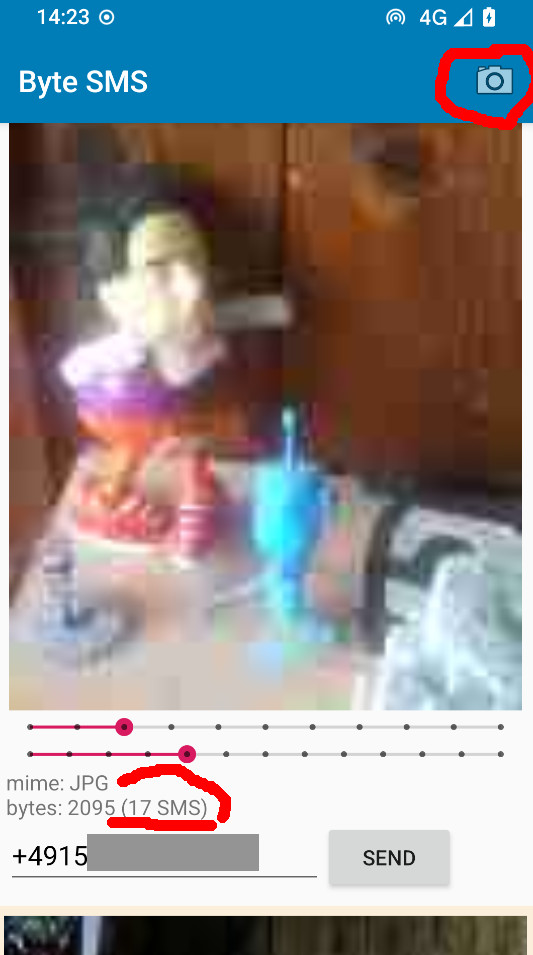
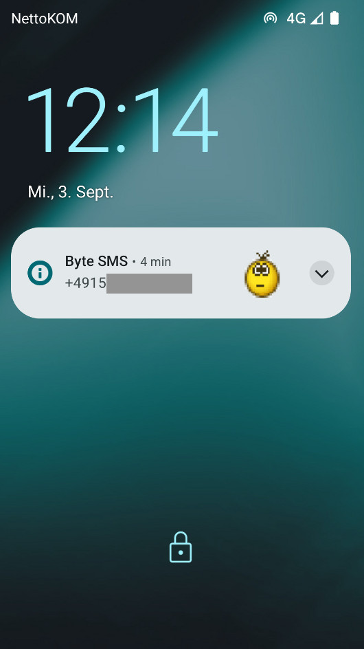
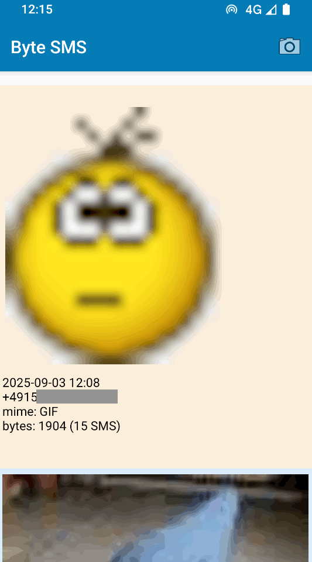

# ByteSMS

ByteSMS uses data SMS to send a very small picture (NOT MMS). It uses
It is a *proof of concept* App and Open Source on github. If you
want to enlarge the features, you have to do it by your own.

A sms flat rate is a good choice!

## Features

- ask and set permissions (and gives a hint to allow notifications for the app)
- uses "share to" function for file access
  - handles **txt**, png, webp, gif and jpeg (unknown are send/stored as .bin files)
  - **gif is animated**
- preview of the shrinked down and compressed cam picture or jpeg file
  - cam works portrait and landscape mode
  - **sliders to change size and compression**
  - calculte how many bytes/sms it will be
- the data sms are **hidden in normal sms/mms apps**
- vibrate, LED and sound-notification with preview in the notification
- checks the limit of 256 messages for each image
- the received data is **stored as file** on the device
- reads **exif rotation** from jpeg files and rotate it in preview
- internal: delete old .tmp files

## Download APK

Version 3.x code is in alpha state: get it from [Releases](https://github.com/no-go/ImageSms/releases)

## Screenshots

For example 

or see folder `images/`.

## Issues

- there is no sent-box to see the sent images
- maybe the app goes powerdown and sleep and single data sms are dropped
- user has to resart the app after setting permissions
- the permission handly only on app-start is a bad choice
- I set the limit of stored images to 32 for each sending tel no. (address)
- the sqlite storage and indices are ugly.
- The hint "20 SMS in 30min per App limit" my break the sending. I am struggling to handle this limit or change it.
- Because the default datasms api from Android is stupid, I have to
  make my own small header to each datasms. the theoretical size of 140 is shrinked down to 130!
- not tested on Android 4.4

## Permissions

I love my privacy. Thus I love apps with only a couple of permissions. ByteSMS access on:

- SMS (read and send)
- Camera
- Files
- Notification
- Vibrate

ByteSMS does not use access to:

- Contacts

This may be strange to you, because you need a phone number and there is no contact selection.

## License

This is free and unencumbered software released into the public domain.

Anyone is free to copy, modify, publish, use, compile, sell, or distribute this
software, either in source code form or as a compiled binary, for any purpose,
commercial or non-commercial, and by any means.

In jurisdictions that recognize copyright laws, the author or authors of this software
dedicate any and all copyright interest in the software to the public domain. We make
this dedication for the benefit of the public at large and to the detriment of our
heirs and successors. We intend this dedication to be an overt act of relinquishment
in perpetuity of all present and future rights to this software under copyright law.

THE SOFTWARE IS PROVIDED "AS IS", WITHOUT WARRANTY OF ANY KIND, EXPRESS OR IMPLIED,
INCLUDING BUT NOT LIMITED TO THE WARRANTIES OF MERCHANTABILITY, FITNESS FOR A PARTICULAR
PURPOSE AND NONINFRINGEMENT. IN NO EVENT SHALL THE AUTHORS BE LIABLE FOR ANY CLAIM,
DAMAGES OR OTHER LIABILITY, WHETHER IN AN ACTION OF CONTRACT, TORT OR OTHERWISE,
ARISING FROM, OUT OF OR IN CONNECTION WITH THE SOFTWARE OR THE USE OR OTHER
DEALINGS IN THE SOFTWARE.

For more information, please refer to [http://unlicense.org](http://unlicense.org)

## Privacy Policy

### Personal information.

Personal information is data that can be used to uniquely identify or contact a
single person. I DO NOT collect, transmit, store or use any personal information while you use this app.

### Non-Personal information.

I DO NOT collect non-personal information like user's behavior:

- to solve App problems
- to show personalized ads

The Google Play Store collects non-personal information such as the data of install (country and equipment), BUT ...

- I did not add any Google or ad keys or codes for marketing feedback, Ads or a payment system to the app
- I did not add this App to the Google Play Store!

### Privacy Questions.

If you have any questions or concerns about my Privacy Policy or data processing, please contact me.
